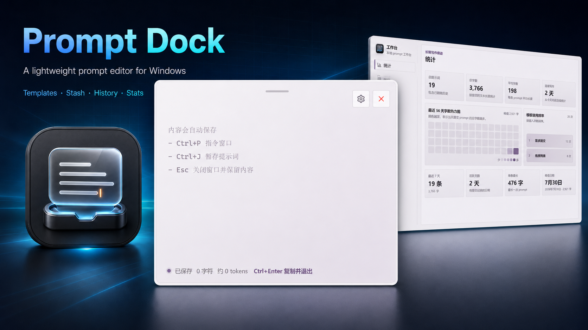

# Prompt Dock



Prompt Dock 是一个 Windows 桌面端 prompt 编辑器。它常驻后台，通过全局快捷键唤出纯净编辑窗口，帮助用户在任意输入场景中更舒服地编写、暂存、套用和提交 prompt。

当前版本：`1.0.0`

## 核心能力

- 全局唤起/隐藏编辑窗口：默认 `Ctrl + L`
- 纯净编辑窗口：大文本框、顶部拖动条、右上角工作台入口和关闭按钮
- 自动保存草稿：输入中的内容持续覆盖保存，下次打开自动恢复
- 复制并退出：默认 `Ctrl + Enter`，写入历史、更新统计、清空编辑框并隐藏窗口
- 指令窗口：默认 `Ctrl + P`，支持固定模板和暂存箱选择
- 暂存箱：默认 `Ctrl + J`，把当前未完成 prompt 放入暂存箱并清空编辑框
- 工作台：统计、模板、历史、暂存、外观、设置、关于集中管理
- 主题系统：简约、水墨、极客三套主题系列，每套包含 3 个日间子主题和 2 个夜间子主题
- 后台托盘运行：托盘菜单可打开编辑窗口、工作台或退出
- 单实例运行：重复打开 exe 会唤起工作台

## 快捷键

快捷键可在 `工作台 -> 设置` 中修改。编辑窗口中的 placeholder 会读取当前设置。

| 默认快捷键 | 作用 | 范围 |
| --- | --- | --- |
| `Ctrl + L` | 唤起或隐藏编辑窗口 | 全局 |
| `Ctrl + Enter` | 复制当前 prompt、写入历史、清空编辑框并退出 | 编辑窗口 |
| `Ctrl + P` | 打开指令窗口 | 编辑窗口 |
| `Ctrl + J` | 暂存当前 prompt 并清空编辑框 | 编辑窗口 |
| `Ctrl + Shift + S` | 将当前内容保存为固定模板 | 编辑窗口 |
| `Ctrl + H` | 打开工作台并查看历史相关内容 | 编辑窗口 |
| `Ctrl + ,` | 打开工作台 | 编辑窗口 |
| `Esc` | 先关闭命令弹层，再隐藏编辑窗口并保留草稿 | 编辑窗口 |

## 窗口设计

### 编辑窗口

编辑窗口用于高频写作。主体是无干扰文本框，placeholder 显示自动保存和快捷键提示；右上角有工作台按钮和红色叉号；底部信息栏显示保存状态、字符数、估算 token 和提交提示。

编辑窗口无系统标题栏，可以通过顶部细拖动条移动。窗口通过全局快捷键唤起时会恢复设置中的尺寸、居中显示并聚焦。

### 工作台

工作台用于低频管理，采用左侧导航和右侧内容栏。

当前 tab 顺序：

1. 统计
2. 模板
3. 历史
4. 暂存
5. 外观
6. 设置
7. 关于

## 功能说明

### 统计

- 按天统计 prompt 总字数和总条数
- 展示总条数、总字数、平均字数、最长 prompt 等概览
- 统计模板使用频率
- 暂存内容不纳入统计，只有 `Ctrl + Enter` 提交的 prompt 会计入

### 模板

- 固定模板，不做变量填充
- 支持新增、编辑、复制、删除
- 支持置顶，置顶模板会在工作台和指令窗口优先显示

### 历史

- 仅在提交时新增历史
- 支持单条查看、复制、保存为模板、删除
- 支持清理所有历史，危险操作需要二次确认
- 历史保留数量可配置，范围 `30-3000`，默认 `200`

### 暂存

- 可保存多个未完成 prompt
- 指令窗口中有“暂存箱”入口，可键盘选择续写
- 工作台暂存 tab 可查看、展开/收起、书写、删除
- 续写暂存时，如果编辑框已有内容，会先把当前内容挤入暂存箱

### 外观

- 支持三套主题系列：简约、水墨、极客
- 每套主题系列包含 5 个子主题：3 个日间、2 个夜间
- 主题会影响配色、背景纹理、面板材质、边框、阴影、按钮和选中文本样式
- 支持设置编辑框透明度和编辑框宽高

## 技术栈

- 桌面框架：Tauri 2
- 前端：React 18 + TypeScript + Vite
- 原生能力：Rust command、Tauri tray、global shortcut、single instance
- 图标：lucide-react + Tauri icon assets
- 数据存储：当前使用 localStorage
- 目标平台：Windows

## 开发

安装依赖：

```powershell
npm.cmd install
```

启动前端开发服务器：

```powershell
npm.cmd run dev
```

启动 Tauri 开发模式：

```powershell
npm.cmd run tauri -- dev
```

## 构建桌面端

生成可测试的 Windows 桌面程序：

```powershell
npm.cmd run tauri -- build
```

常见产物位置：

- `src-tauri/target/release/prompt-dock.exe`
- `src-tauri/target/release/bundle/nsis/Prompt Dock_1.0.0_x64-setup.exe`
- `src-tauri/target/release/bundle/msi/Prompt Dock_1.0.0_x64_en-US.msi`

## 开发验收规则

后续每次完成功能或修复后，默认执行：

```powershell
npm.cmd run tauri -- build
```

验收目标是产出可测试的桌面 exe。文档类改动可以只做文本检查；功能或修复类改动需要完成桌面端构建，并在结果中说明构建是否通过以及产物位置。

## 项目结构

```text
.
├─ docs/
│  └─ demandlist.md
├─ src/
│  ├─ components/
│  ├─ data/
│  ├─ lib/
│  ├─ styles/
│  ├─ App.tsx
│  └─ main.tsx
├─ src-tauri/
│  ├─ capabilities/
│  ├─ icons/
│  ├─ src/
│  │  └─ main.rs
│  ├─ Cargo.toml
│  └─ tauri.conf.json
├─ codex.md
├─ package.json
└─ README.md
```
