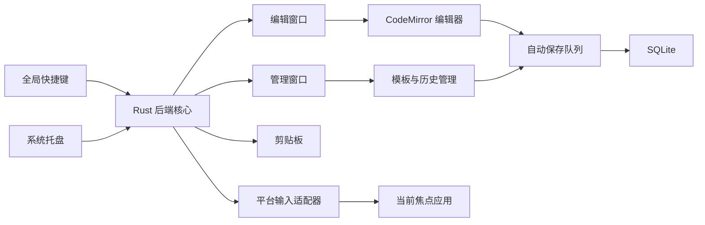

# Prompt Dock 需求与设计清单

版本日期：2026-07-29

## 1. 产品定位

Prompt Dock 是一个轻量级桌面 prompt 编辑器，用于在任意输入场景中快速唤起、编辑、套用模板、恢复草稿，并将最终 prompt 输入到当前光标位置或复制到剪贴板。

核心目标：

- 全程键盘操作：唤起、选择模板、编辑、提交、复制、隐藏都能通过快捷键完成。
- 低打扰：后台常驻，托盘静默运行，编辑窗口只在需要输入 prompt 时出现。
- 高可靠：编辑内容持续自动保存，异常退出或中途切换场景后可恢复。
- 本地优先：prompt、模板、历史、设置默认仅保存在本机。
- 轻量：启动快、资源占用低、界面聚焦编辑本身。

## 2. 使用场景

### 2.1 快捷唤出并输入

用户在任意应用中准备输入 prompt：

1. 按全局快捷键唤起 Prompt Dock。
2. 直接编辑 prompt，或从模板中选择一个 prompt。
3. 按快捷键将文本输入到原光标位置。
4. Prompt Dock 自动隐藏，回到原应用。

### 2.2 快捷复制

用户需要将 prompt 放到剪贴板：

1. 唤起 Prompt Dock。
2. 编辑或选择模板。
3. 按快捷键复制当前内容。
4. 显示短暂成功反馈，窗口可自动隐藏或保持打开。

### 2.3 固定模板套用

用户保存常用 prompt 模板，例如“代码审查”“论文解释”“生成 Midjourney 提示词”：

1. 唤起模板选择器。
2. 输入关键词筛选模板。
3. 选择模板后将固定模板内容插入编辑器。
4. 在模板内容基础上补充任务、上下文、输出要求。
5. 继续编辑或直接提交。

### 2.4 草稿恢复

用户输入到一半切走应用、关机、崩溃或稍后继续：

1. 再次唤起 Prompt Dock。
2. 自动恢复上次未提交草稿。
3. 可在管理窗口查看完成历史并恢复。

## 3. 技术选型

### 3.1 推荐技术栈

| 模块 | 推荐方案 | 选择理由 |
| --- | --- | --- |
| 桌面壳 | Tauri 2 | 体积小，资源占用低，适合自用工具；Rust 后端便于接入系统能力 |
| 前端 | React + TypeScript + Vite | 生态成熟，开发效率高，和 Tauri 配合简单 |
| 编辑器 | CodeMirror 6 | 比 Monaco 更轻，支持快捷键、语法高亮、扩展、历史记录 |
| 状态管理 | Zustand 或 React Context | 状态规模较小，避免引入重型架构 |
| 本地数据库 | SQLite + Rust `rusqlite` | 单文件可靠存储，事务能力好，适合模板、草稿、历史 |
| 全局快捷键 | `tauri-plugin-global-shortcut` | 覆盖唤起、提交、复制等核心操作 |
| 剪贴板 | `tauri-plugin-clipboard-manager` + Rust fallback | 支持复制 prompt，提交失败时可降级为剪贴板方案 |
| 系统托盘 | Tauri tray | 后台静默运行、快速打开设置和退出 |
| 原生输入 | Rust Windows 适配层 | Windows 使用 SendInput 与剪贴板粘贴完成输入闭环 |
| 搜索 | Fuse.js 或自建轻量 fuzzy | 模板数量较小时简单可靠 |
| 打包 | Tauri Bundler | 输出 Windows 安装包 |

### 3.2 平台优先级

当前阶段只做 Windows。所有技术设计、快捷键、托盘、剪贴板、焦点恢复和文本输入能力都以 Windows 桌面环境为准。

- 全局快捷键。
- 托盘常驻。
- 复制到剪贴板。
- 将文本输入到当前焦点应用。
- 启动时最小化到后台。

暂不纳入当前版本：

- macOS。
- Linux。
- 跨平台输入适配层。

### 3.3 备选方案评估

| 方案 | 优点 | 风险 |
| --- | --- | --- |
| Electron | 桌面能力成熟，生态极大 | 体积和内存占用偏高，自用轻量工具成本较大 |
| Wails | Go 技术栈简洁，体积较小 | 前端生态与系统插件成熟度弱于 Tauri |
| 原生 Windows WPF/WinUI | 系统集成强，输入能力直接 | 跨平台成本高，UI 迭代效率较低 |
| AutoHotkey + WebView | 上手快，适合个人脚本 | 长期维护、UI 复杂度、数据可靠性较弱 |

结论：Windows MVP 采用 Tauri 2 + React + TypeScript + Rust + SQLite。

## 4. 总体架构



### 4.1 前端职责

- 编辑窗口 UI。
- 管理窗口 UI。
- 模板列表、搜索、固定模板套用。
- 草稿状态、保存状态、错误提示。
- 快捷键提示与管理窗口。
- 轻量动画和焦点管理。

### 4.2 Rust 后端职责

- 全局快捷键注册。
- 窗口显示、隐藏、置顶、焦点恢复。
- 托盘菜单。
- SQLite 读写和迁移。
- 剪贴板读写。
- 平台级文本输入。
- 崩溃恢复和日志。

### 4.3 平台输入策略

优先顺序：

1. 直接模拟文本输入或粘贴到原焦点位置。
2. 复制到剪贴板后触发系统粘贴快捷键。
3. 仅复制到剪贴板，并提示用户手动粘贴。

提交前需要记录原焦点窗口句柄：

- 唤起窗口前记录当前前台窗口。
- 提交时隐藏 Prompt Dock。
- 恢复原窗口焦点。
- 执行输入或粘贴。
- 可选恢复用户原剪贴板内容。

## 5. 功能设计

### 5.1 全局快捷键

默认快捷键建议：

| 操作 | 默认快捷键 | 说明 |
| --- | --- | --- |
| 唤起/隐藏 | `Ctrl+L` | 在任意应用中打开或收起 |
| 复制并退出 | `Ctrl+Enter` | 复制当前 prompt，保存到历史，清空编辑器并退出 |
| 打开模板选择 | `Ctrl+P` | 模板快速搜索 |
| 保存为模板 | `Ctrl+Shift+S` | 将当前内容保存为模板 |
| 打开历史草稿 | `Ctrl+H` | 查看最近自动保存内容 |
| 退出/关闭窗口 | `Esc` | 优先关闭弹层，再隐藏编辑窗口 |

所有快捷键支持用户自定义，并检测冲突。

### 5.2 编辑器

核心能力：

- 多行纯文本编辑。
- Markdown 轻量高亮。
- 撤销/重做。
- 字数、字符数、估算 token 数。
- 自动换行。
- 当前草稿保存状态提示。
- 粘贴大段文本时保持性能稳定。

增强能力：

- prompt 片段插入。
- 固定模板插入。
- 快速格式化空行、去除首尾空白。
- 一键包裹代码块。

### 5.3 模板库

模板字段：

- 标题。
- 用途说明。
- 正文。
- 最近使用时间。
- 使用次数。

第一版只做固定模板。模板正文按原样插入编辑器，用户在编辑器中继续补充任务和上下文。变量、表单填充、选择项和默认值保留为后续版本能力。

模板操作：

- 新建、编辑、删除。
- 从当前 prompt 保存为模板。
- 模板复制。
- 模板导入导出为 JSON 或 Markdown。
- 最近使用和收藏。

### 5.4 自动缓存与草稿

缓存机制是核心能力，优先保证可靠性。

自动保存策略：

- 编辑后 500ms debounce 保存当前草稿。
- 窗口隐藏、提交、复制、应用退出时立即保存。
- 数据库写入使用事务。
- 启动时检查上次异常退出状态。

草稿分类：

| 类型 | 用途 |
| --- | --- |
| 当前草稿 | 主编辑器最近内容 |
| 未提交草稿 | 用户隐藏窗口或切换场景后保留 |
| 完成历史 | 仅记录 `Ctrl+Enter` 复制并退出的 prompt |

恢复规则：

- 打开时默认恢复上次未提交草稿。
- 若上次 prompt 已提交，打开空白编辑器或用户指定默认模板。
- 用户可在管理窗口中选择“总是恢复最后内容”或“提交后保留当前内容”。

数据保留策略：

- 当前草稿永久保留，直到用户在管理窗口中删除或被新草稿覆盖。
- 完成历史默认保留 30 天，可关闭。
- 支持一键清除历史与缓存。

### 5.5 输出到目标应用

输出模式：

| 模式 | 说明 | 默认 |
| --- | --- | --- |
| 直接输入 | 使用平台 API 模拟文本输入 | Windows 可优先尝试 |
| 剪贴板粘贴 | 写入剪贴板后触发粘贴快捷键 | 推荐默认 |
| 仅复制 | 只复制，不触发粘贴 | 兜底模式 |

剪贴板粘贴流程：

1. 保存当前剪贴板内容。
2. 写入 prompt。
3. 隐藏窗口并恢复原焦点。
4. 发送 `Ctrl+V`。
5. 延迟后恢复原剪贴板内容。

风险处理：

- 某些应用禁止模拟输入时，自动降级为仅复制。
- 大文本输入时优先使用剪贴板粘贴，降低逐字输入耗时。
- 粘贴失败时显示状态反馈，保留 prompt 内容。

### 5.6 后台静默运行

能力：

- 启动后进入托盘。
- 关闭窗口时隐藏到后台。
- 托盘菜单包含打开编辑窗口、打开管理窗口、暂停快捷键、退出。
- 可设置开机启动。
- 可设置唤起后窗口位置：屏幕中央、鼠标附近、上次位置。

### 5.7 管理窗口设置项

设置项集中放在管理窗口中：

- 快捷键配置。
- 输出模式。
- 提交后行为：隐藏、保持、保留。
- 自动保存间隔。
- 历史保留周期。
- 主题：跟随系统、浅色、深色。
- 透明度与动效偏好。
- 开机启动。
- 数据导入导出。

## 6. 数据设计

### 6.1 SQLite 表结构草案

```sql
CREATE TABLE templates (
  id TEXT PRIMARY KEY,
  title TEXT NOT NULL,
  description TEXT,
  body TEXT NOT NULL,
  tags TEXT NOT NULL DEFAULT '[]',
  is_favorite INTEGER NOT NULL DEFAULT 0,
  usage_count INTEGER NOT NULL DEFAULT 0,
  created_at TEXT NOT NULL,
  updated_at TEXT NOT NULL,
  last_used_at TEXT
);

CREATE TABLE drafts (
  id TEXT PRIMARY KEY,
  kind TEXT NOT NULL,
  body TEXT NOT NULL,
  template_id TEXT,
  metadata TEXT NOT NULL DEFAULT '{}',
  created_at TEXT NOT NULL,
  updated_at TEXT NOT NULL
);

CREATE TABLE prompt_history (
  id TEXT PRIMARY KEY,
  body TEXT NOT NULL,
  action TEXT NOT NULL,
  target_app TEXT,
  created_at TEXT NOT NULL
);

CREATE TABLE settings (
  key TEXT PRIMARY KEY,
  value TEXT NOT NULL,
  updated_at TEXT NOT NULL
);
```

### 6.2 文件位置

当前版本使用 Windows 应用数据目录：

- Windows: `%APPDATA%/PromptDock/`

文件：

- `prompt-dock.sqlite`
- `logs/app.log`
- `backup/templates.json`
- `backup/settings.json`

## 7. UI/UX 设计

设计参照 Apple Design 原则：即时响应、直接操控、空间一致、可中断动效、克制的材质层级、尊重辅助功能。

### 7.1 窗口模型

第一版包含两个窗口：编辑窗口和管理窗口。

#### 编辑窗口

形态：

- 纯净浮层编辑框，默认宽 760px，高 520px。
- 居中或出现在当前输入区域附近。
- 窗口置顶，失焦后按管理窗口中的设置自动隐藏。
- 默认隐藏标题栏和菜单栏，视觉上只保留编辑区。
- 支持所有核心快捷键：提交、复制、模板选择、历史草稿、隐藏。
- 角落保留一个进入管理窗口的图标按钮，使用齿轮或侧栏图标，悬停显示名称。

布局：

```text
┌────────────────────────────────────────────┐
│                                      ⚙      │
│                                            │
│              纯净 prompt 编辑区             │
│                                            │
│                                            │
│                              已保存 · 估算token │
└────────────────────────────────────────────┘
```

视觉原则：

- 主编辑区占据最大空间。
- 除角落图标和轻量状态提示外，不放常驻工具栏。
- 状态反馈短暂、轻量，避免遮挡文本。
- 角落图标面积足够键鼠操作，视觉权重低于正文。

#### 管理窗口

形态：

- 标题为 Prompt Dock。
- 默认宽 920px，高 640px。
- 分两栏显示：左栏导航栏，右栏内容栏。
- 管理窗口用于模板、历史、快捷键、输出、外观、数据管理等低频操作。
- 可从编辑窗口角落图标、托盘菜单或 `Ctrl+,` 打开。

布局：

```text
┌──────────────────────────────────────────────┐
│ Prompt Dock                                   │
├──────────────┬───────────────────────────────┤
│ 模板          │                               │
│ 历史          │          当前选中内容          │
│ 快捷键        │                               │
│ 输出          │                               │
│ 外观          │                               │
│ 数据          │                               │
└──────────────┴───────────────────────────────┘
```

视觉原则：

- 左栏保持稳定，点击后只替换右侧内容。
- 当前导航项有清晰选中态。
- 高频信息优先显示在右栏顶部。
- 管理窗口可以承载表格、表单和列表，编辑窗口保持安静。
- 状态反馈短暂、轻量，避免遮挡文本。

### 7.2 模板选择器

交互：

- `Ctrl+P` 打开模板选择器。
- 输入关键词实时筛选。
- 上下方向键选择。
- `Enter` 应用模板。
- 应用后将固定模板正文插入编辑器。
- `Esc` 返回编辑器。

布局：

- 顶部搜索框。
- 中部模板列表。
- 右侧或下方显示模板预览。
- 收藏和最近使用靠前。

模板选项保持紧凑：

- 模板标题和用途说明写在同一行。
- 不显示标签。
- 选中态只用背景和边框强调。

### 7.3 固定模板套用

第一版先不做变量填充，只做固定模板。

- 模板正文按原样插入编辑窗口。
- 若编辑窗口已有内容，默认在光标处插入模板。
- 可通过管理窗口维护模板标题、正文、用途说明、收藏状态。
- 选择模板后立即回到编辑窗口，并保留继续编辑能力。
- 变量、表单填充、默认值和字段校验放入后续版本。

动效：

- 模板选择器从编辑窗口当前位置轻量浮现。
- 退出沿原路径收回。
- 选择结果即时插入并给出轻量完成反馈。
- 开启减少动态效果时，使用淡入淡出。

### 7.4 历史与草稿

历史面板：

- `Ctrl+H` 打开。
- 左侧按时间列出完成历史。
- 右侧预览内容差异。
- `Enter` 恢复选中版本。

恢复提示：

- 启动后若发现未提交草稿，在编辑器顶部显示一条轻量提示。
- 提示包含“继续编辑”“查看历史”“关闭提示”。
- 提示可用键盘聚焦和关闭。

### 7.5 管理窗口

管理窗口就是设置与内容管理页，通过编辑窗口角落图标、托盘菜单或 `Ctrl+,` 打开。

左栏导航：

- 模板。
- 历史。
- 快捷键。
- 输出。
- 外观。
- 数据。

右栏内容：

- 模板：新建、编辑、删除、收藏、导入导出。
- 历史：查看完成历史、恢复选中版本、删除记录。
- 快捷键：录制快捷键、检测冲突、恢复默认值。
- 输出：选择直接输入、剪贴板粘贴、仅复制，设置提交后窗口行为。
- 外观：主题、透明度、减少动态效果、窗口位置。
- 数据：开机启动、备份、恢复、清理历史、查看数据库位置。

设置项使用平台熟悉控件：

- 开关用于布尔设置。
- 分段控件用于输出模式、主题模式。
- 输入框用于快捷键录制。
- 步进器或滑块用于保存间隔、历史保留数。

### 7.6 动效与反馈

动效原则：

- 唤起窗口从当前屏幕中心或鼠标附近轻微缩放进入。
- 隐藏沿同一路径退出。
- 动画可随用户操作中断。
- 任何提交、复制、恢复动作都在同一帧给出视觉反馈。
- 错误状态使用明确文字和轻微色彩变化，避免剧烈闪烁。

建议参数：

| 场景 | 参数 |
| --- | --- |
| 普通窗口出现 | damping `1.0`, response `0.3-0.4` |
| 管理窗口打开 | damping `1.0`, response `0.3-0.4` |
| 列表选择移动 | 80-120ms 轻量过渡 |
| 成功反馈 | 120ms 出现，1200ms 后消失 |
| 减少动态效果 | 150-200ms opacity transition |

### 7.7 视觉风格

目标观感：

- 安静、清晰、工具感强。
- 系统字体优先。
- 支持浅色和深色主题。
- 主色用于焦点与确认动作，避免大面积高饱和色。
- 半透明材质只用于窗口 chrome、命令面板等浮层。
- 内容区域保持高对比和良好可读性。

建议色彩：

- 背景：跟随系统窗口背景。
- 文本：系统主文本色。
- 次级信息：系统次级文本色。
- 主操作：蓝或青绿色。
- 警告：琥珀色。
- 错误：红色。

### 7.8 可访问性

要求：

- 所有功能可通过键盘完成。
- 焦点环清晰可见。
- 支持系统字体缩放。
- 支持减少动态效果。
- 支持减少透明度。
- 支持高对比模式。
- 模板和历史列表可被屏幕阅读器识别。

## 8. MVP 范围

第一版必须完成：

- Tauri 应用骨架。
- 后台托盘运行。
- 全局快捷键唤起和隐藏。
- 纯净编辑窗口。
- 管理窗口。
- 自动保存当前草稿。
- 再次打开恢复草稿。
- 复制到剪贴板。
- 通过剪贴板粘贴到原焦点应用。
- 固定模板新建、选择、套用。
- 管理窗口中配置默认快捷键和输出模式。
- Windows 打包。

第一版暂缓：

- 云同步。
- 多设备共享。
- AI 自动生成模板。
- 团队模板库。
- 变量填充。
- 复杂富文本编辑。
- 插件系统。

## 9. 质量指标

| 指标 | 目标 |
| --- | --- |
| 冷启动时间 | 2 秒内 |
| 后台内存 | Windows 常驻小于 150MB |
| 唤起响应 | 快捷键触发后 150ms 内显示窗口 |
| 自动保存延迟 | 停止输入后 500ms 内入库 |
| 崩溃恢复 | 最近 5 秒输入内容尽量可恢复 |
| 复制/粘贴失败 | 内容必须仍保留在编辑器和剪贴板兜底 |
| 输入延迟 | 大文本优先剪贴板粘贴，避免逐字模拟 |

## 10. 里程碑

### Milestone 1: 应用骨架

- 初始化 Tauri + React + TypeScript。
- 实现窗口、托盘、全局快捷键。
- 实现纯净编辑窗口和管理窗口骨架。

### Milestone 2: 本地数据

- 接入 SQLite。
- 实现 settings、drafts、templates 表。
- 实现自动保存和草稿恢复。

### Milestone 3: 输入闭环

- 实现复制。
- 实现粘贴到原焦点应用。
- 增加失败降级和提示。

### Milestone 4: 模板系统

- 模板 CRUD。
- 模板选择器。
- 固定模板套用。
- 最近使用和收藏。

### Milestone 5: 打磨与打包

- 完成管理窗口各导航页。
- 优化动效、焦点、键盘流。
- 完成 Windows 安装包。
- 编写使用说明和备份说明。

## 11. 风险与处理

| 风险 | 处理 |
| --- | --- |
| 全局快捷键冲突 | 提供快捷键录制和冲突检测 |
| 原焦点应用恢复失败 | 降级为复制到剪贴板 |
| 某些应用禁止模拟输入 | 默认使用剪贴板粘贴模式 |
| 剪贴板覆盖用户内容 | 提交后延迟恢复原剪贴板，可在管理窗口中关闭 |
| 数据库损坏 | WAL、事务、启动校验、JSON 备份 |
| 自动保存频繁写入 | debounce、内容 hash、覆盖当前草稿 |

## 12. 待确认问题

基于评审意见，以下事项已明确：

- **保留 prompt 历史**：确认保留，只记录 `Ctrl+Enter` 复制并退出的 prompt。
- **开机自启动**：确认在管理窗口的设置中添加此项功能。
- **加密本地数据库**：v1 版本不需要。
- **扩展变量模板**：后续版本考虑，v1 不做。
